# Diagramas de políticas (mapa de política)

Mapa mínimo de cada política: alcance → reglas clave → punto de control → ¿cumple? → conforme / gestión de incumplimiento. PNG en `politicas/` (fuente SVG en `fuentes-svg/politicas/`).

### POL-SGSI-01 — Política de control de acceso
*ISO/IEC 27001:2022: 5.15–5.18, 8.2, 8.3, 8.5*

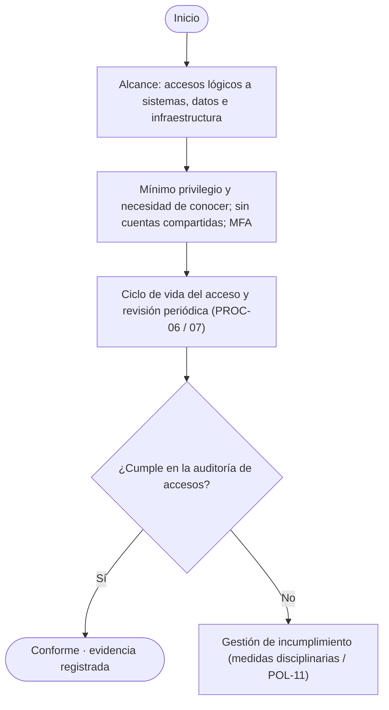

**Roles (RACI):** CISO, Gerencia TI, jefaturas, RRHH  
**Evidencia / registros:** Tickets de acceso, logs, actas de revisión  
**Plazos / hitos:** Revisión semestral  
**PNG:** `politicas/POL-SGSI-01 - Política de control de acceso.png`

### POL-SGSI-02 — Política de gestión de contraseñas y autenticación
*ISO/IEC 27001:2022: 5.17, 8.5*

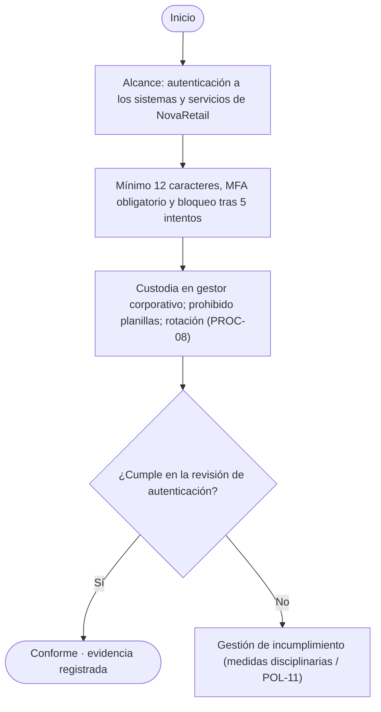

**Roles (RACI):** CISO, Gerencia TI, usuarios  
**Evidencia / registros:** Cobertura de MFA, logs del gestor  
**Plazos / hitos:** Rotación según política  
**PNG:** `politicas/POL-SGSI-02 - Política de gestión de contraseñas y autenticación.png`

### POL-SGSI-03 — Política de respaldo y recuperación
*ISO/IEC 27001:2022: 8.13, 8.14*

**Roles (RACI):** CISO, Infraestructura TI, dueños de activos  
**Evidencia / registros:** Informe de respaldo y de restauración  
**Plazos / hitos:** Prueba trimestral  
**PNG:** `politicas/POL-SGSI-03 - Política de respaldo y recuperación.png`

### POL-SGSI-04 — Política de protección contra malware
*ISO/IEC 27001:2022: 8.7*

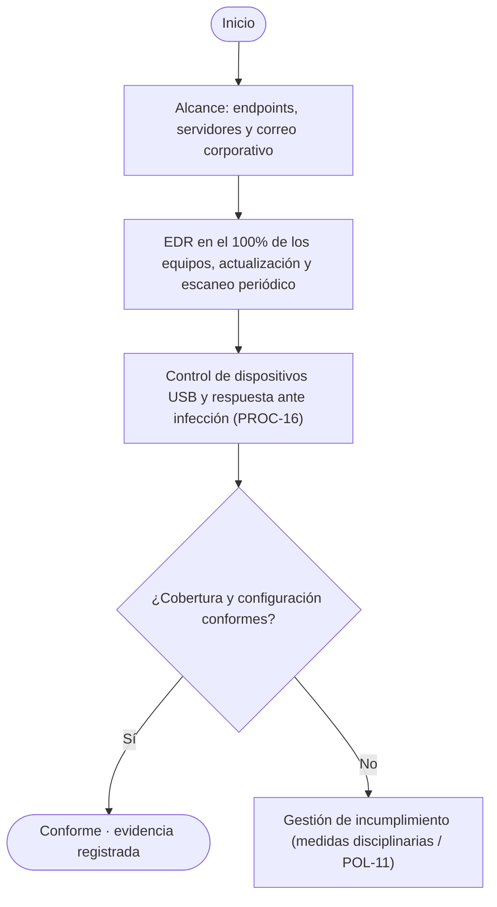

**Roles (RACI):** Gerencia TI, Analista de Ciberseguridad, CISO  
**Evidencia / registros:** Cobertura EDR, reportes de detección  
**Plazos / hitos:** Escaneo semanal  
**PNG:** `politicas/POL-SGSI-04 - Política de protección contra malware.png`

### POL-SGSI-05 — Política de gestión de parches y actualización
*ISO/IEC 27001:2022: 8.8, 8.19*

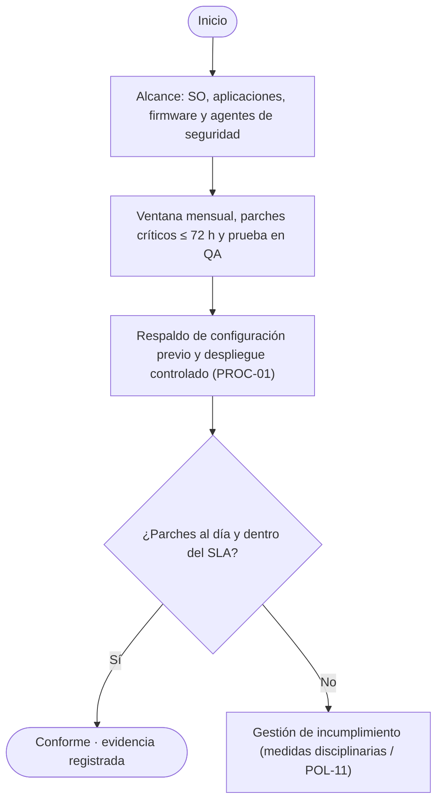

**Roles (RACI):** Gerencia TI, CISO  
**Evidencia / registros:** Reporte de parches, tickets ITSM  
**Plazos / hitos:** Críticos ≤ 72 h  
**PNG:** `politicas/POL-SGSI-05 - Política de gestión de parches y actualización.png`

### POL-SGSI-06 — Política de uso seguro de dispositivos
*ISO/IEC 27001:2022: 6.7, 7.9, 8.1*

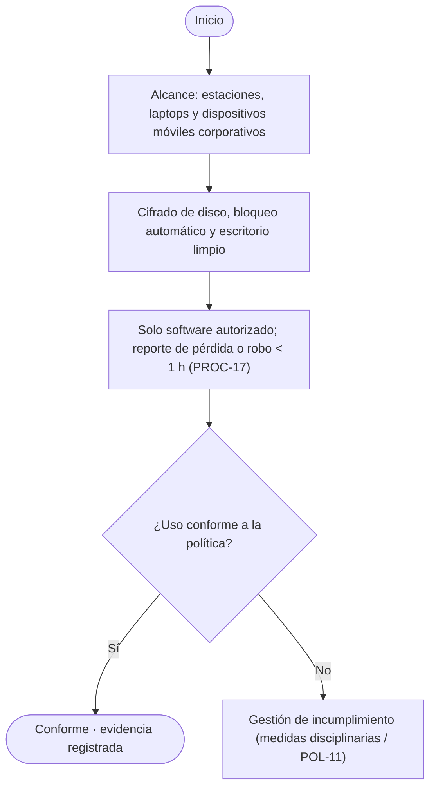

**Roles (RACI):** Gerencia TI, usuarios, jefatura  
**Evidencia / registros:** Acta de entrega, inventario de equipos  
**Plazos / hitos:** Reporte de pérdida < 1 h  
**PNG:** `politicas/POL-SGSI-06 - Política de uso seguro de dispositivos.png`

### POL-SGSI-07 — Política de seguridad de red
*ISO/IEC 27001:2022: 8.20–8.23*

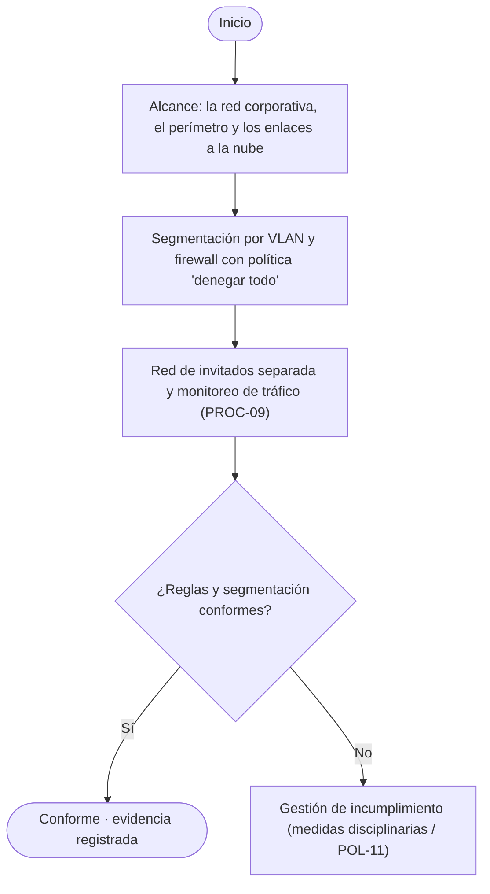

**Roles (RACI):** CISO, Infraestructura TI  
**Evidencia / registros:** Diagrama de red, informe de firewall  
**Plazos / hitos:** Revisión trimestral  
**PNG:** `politicas/POL-SGSI-07 - Política de seguridad de red.png`

### POL-SGSI-08 — Política de registro y monitoreo
*ISO/IEC 27001:2022: 8.15–8.17*

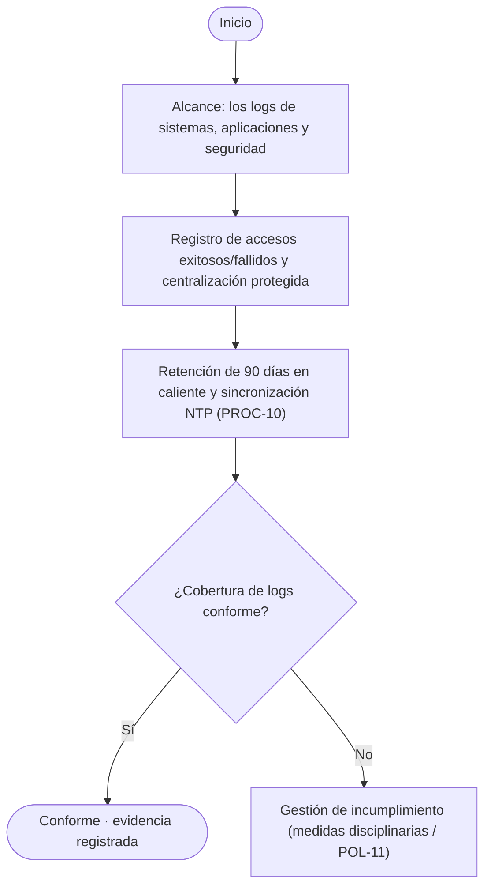

**Roles (RACI):** Gerencia TI, Analista SOC, CISO  
**Evidencia / registros:** Logs centralizados, registro de alertas  
**Plazos / hitos:** Revisión diaria  
**PNG:** `politicas/POL-SGSI-08 - Política de registro y monitoreo.png`

### POL-SGSI-09 — Política de gestión de vulnerabilidades
*ISO/IEC 27001:2022: 8.8, 8.29*

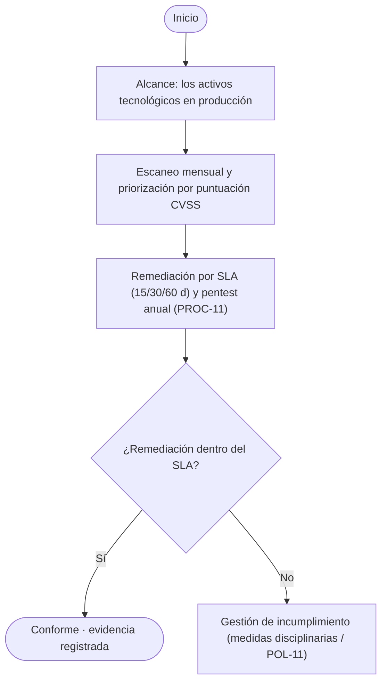

**Roles (RACI):** CISO, Gerencia TI, Desarrollo  
**Evidencia / registros:** Reportes de escaneo, tickets  
**Plazos / hitos:** Críticas ≤ 15 días  
**PNG:** `politicas/POL-SGSI-09 - Política de gestión de vulnerabilidades.png`

### POL-SGSI-10 — Política de manejo de información y clasificación
*ISO/IEC 27001:2022: 5.12–5.14, 8.10–8.12, 8.33*

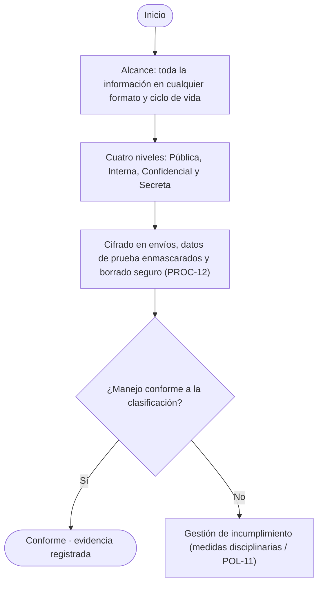

**Roles (RACI):** Dueños de información, CISO, DPO  
**Evidencia / registros:** Etiquetado, registro de eliminación  
**Plazos / hitos:** Revisión anual  
**PNG:** `politicas/POL-SGSI-10 - Política de manejo de información y clasificación.png`

### POL-SGSI-11 — Política de gestión de incidentes y reporte ANCI
*ISO/IEC 27001:2022: 5.24–5.28*

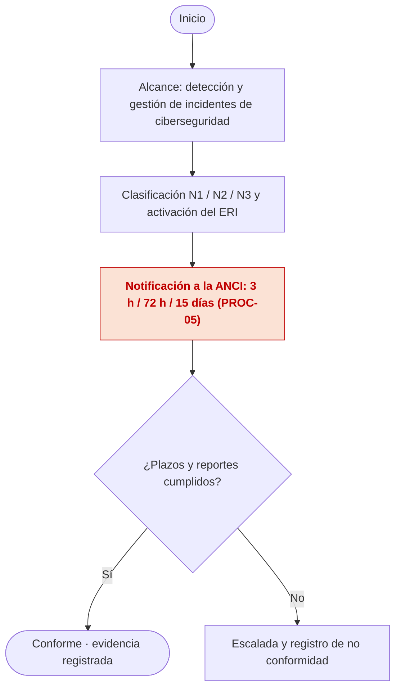

**Roles (RACI):** CISO, ERI, Gerencia, Legal  
**Evidencia / registros:** Ticket, reportes ANCI, informe post-incidente  
**Plazos / hitos:** 3 h / 72 h / 15 días  
**PNG:** `politicas/POL-SGSI-11 - Política de gestión de incidentes y reporte ANCI.png`

### POL-SGSI-12 — Política de cifrado de datos
*ISO/IEC 27001:2022: 8.24*

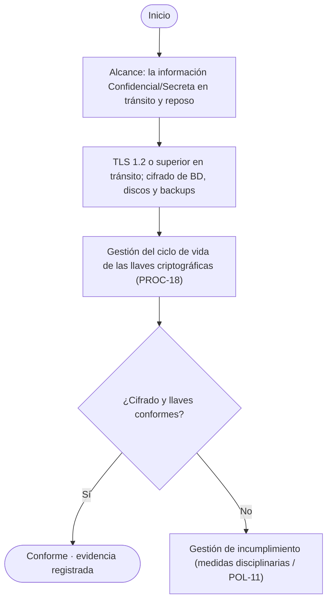

**Roles (RACI):** CISO, Gerencia TI, DBA  
**Evidencia / registros:** Configuración TLS, inventario de llaves  
**Plazos / hitos:** Rotación periódica  
**PNG:** `politicas/POL-SGSI-12 - Política de cifrado de datos.png`

### POL-SGSI-13 — Política de gestión de proveedores y terceros (OIV)
*ISO/IEC 27001:2022: 5.19–5.23*

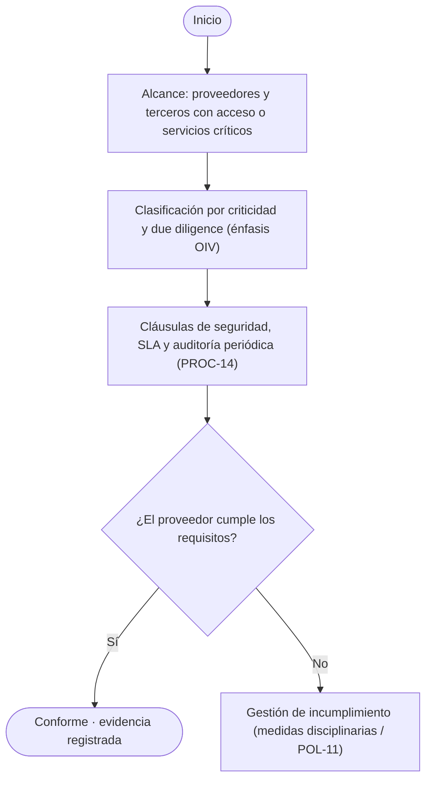

**Roles (RACI):** CISO, Adquisiciones, Legal  
**Evidencia / registros:** Due diligence, contrato, informe de auditoría  
**Plazos / hitos:** Auditoría anual  
**PNG:** `politicas/POL-SGSI-13 - Política de gestión de proveedores y terceros (OIV).png`

### POL-SGSI-14 — Política de contratación y desvinculación
*ISO/IEC 27001:2022: 6.1, 6.2, 6.4–6.6*

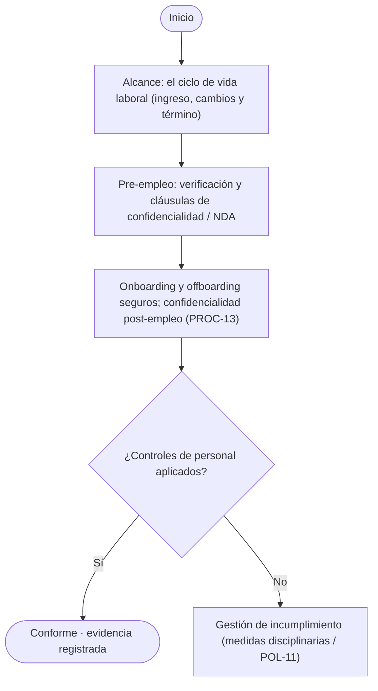

**Roles (RACI):** RRHH, CISO, jefatura, Legal  
**Evidencia / registros:** Checklist on/offboarding, contrato firmado  
**Plazos / hitos:** Baja el mismo día  
**PNG:** `politicas/POL-SGSI-14 - Política de contratación y desvinculación.png`

### POL-SGSI-15 — Política de línea base de software
*ISO/IEC 27001:2022: 8.9, 8.19*

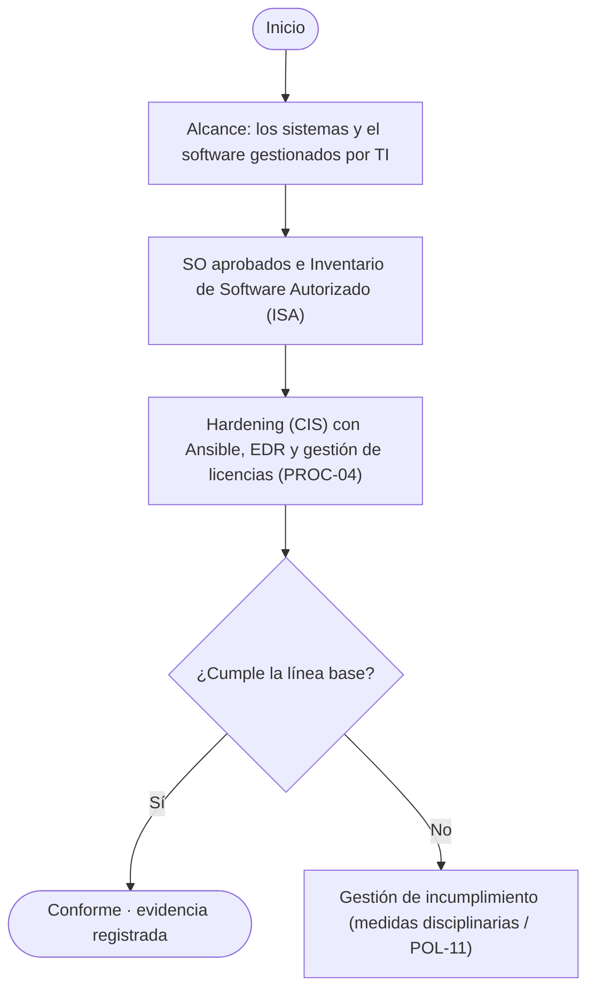

**Roles (RACI):** CISO, Gerencia TI  
**Evidencia / registros:** ISA, reportes de cumplimiento, registro de licencias  
**Plazos / hitos:** Auditoría semestral  
**PNG:** `politicas/POL-SGSI-15 - Política de línea base de software.png`
