# Diagramas de procedimientos (BPMN / flowchart)

Un diagrama por procedimiento del SGSI de NovaRetail SpA. Se renderizan en GitHub (Mermaid) y tienen su PNG en `procedimientos/` (fuente SVG en `fuentes-svg/procedimientos/`).

### PROC-SGSI-01 — Gestión de actualizaciones y parches
*ISO/IEC 27001:2022: 8.8, 8.19*

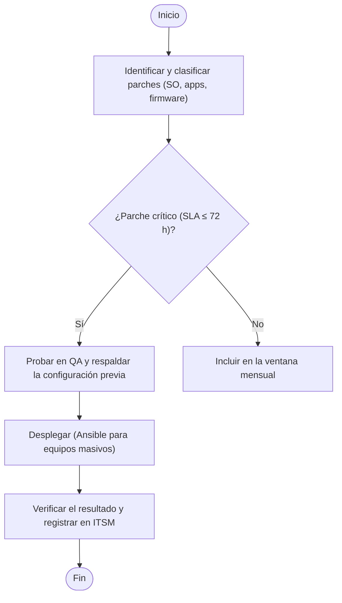

**Roles (RACI):** Gerencia TI  
**Evidencia / registros:** Ticket ITSM, reporte de parches  
**Plazos / hitos:** Críticos ≤ 72 h  
**PNG:** `procedimientos/PROC-SGSI-01 - Gestión de actualizaciones y parches.png`

### PROC-SGSI-02 — Backup de base de datos
*ISO/IEC 27001:2022: 8.13, 8.14*

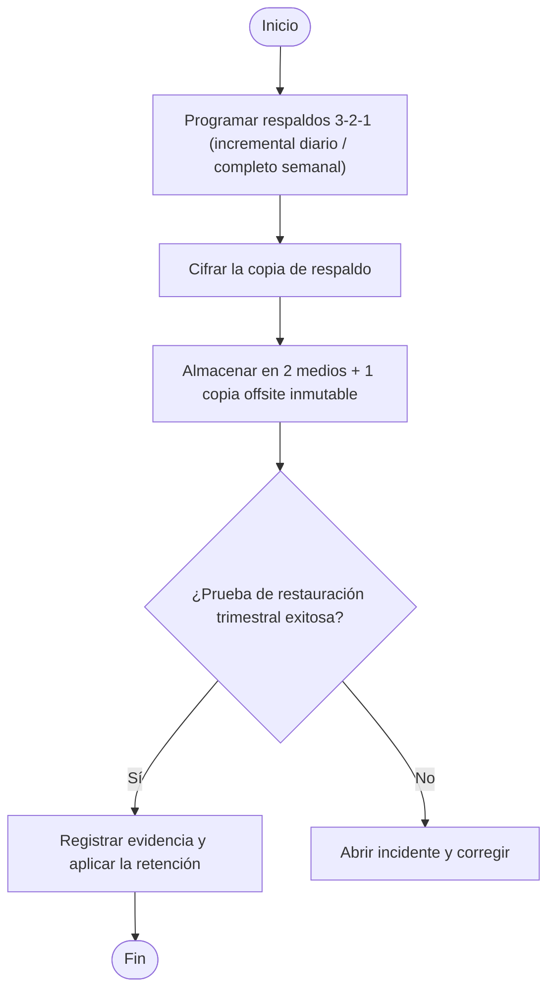

**Roles (RACI):** Gerencia TI / DBA  
**Evidencia / registros:** Informe de respaldo y de restauración  
**Plazos / hitos:** Prueba trimestral  
**PNG:** `procedimientos/PROC-SGSI-02 - Backup de base de datos.png`

### PROC-SGSI-03 — Rollback
*ISO/IEC 27001:2022: 8.13, 8.32*

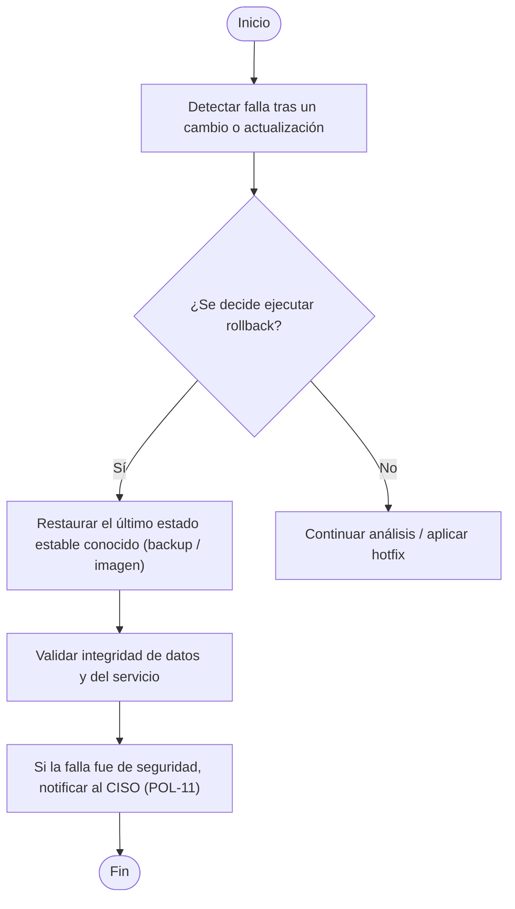

**Roles (RACI):** Gerencia TI / DBA  
**Evidencia / registros:** Registro de rollback, ticket de cambio  
**PNG:** `procedimientos/PROC-SGSI-03 - Rollback.png`

### PROC-SGSI-04 — Línea base de software (Ansible)
*ISO/IEC 27001:2022: 8.9, 8.19, 8.32*

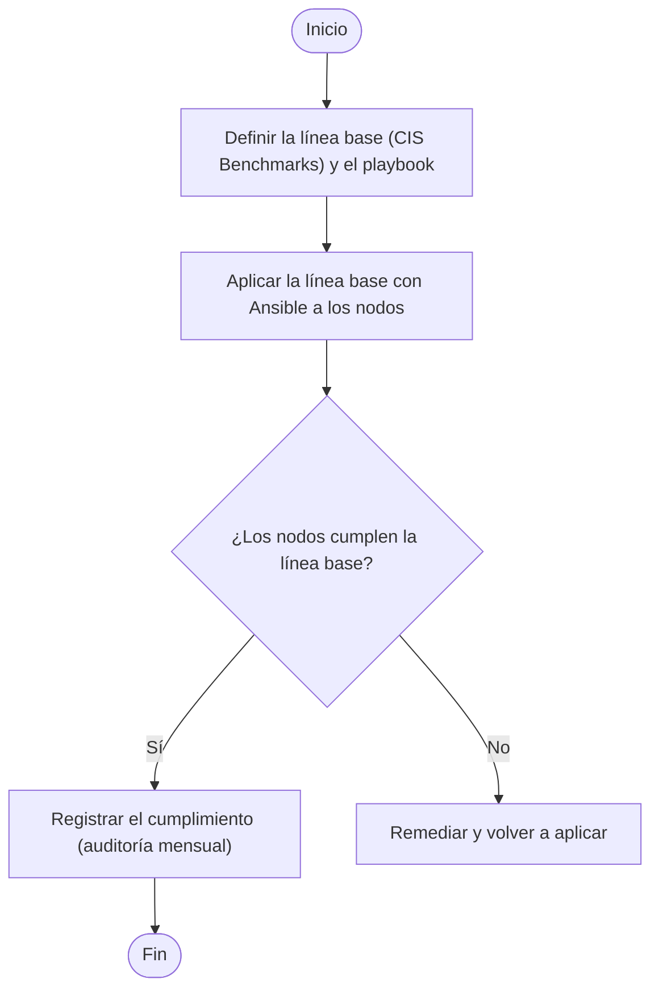

**Roles (RACI):** Gerencia TI  
**Evidencia / registros:** Salida de Ansible, reporte de cumplimiento  
**Plazos / hitos:** Auditoría mensual  
**PNG:** `procedimientos/PROC-SGSI-04 - Línea base de software (Ansible).png`

### PROC-SGSI-05 — Gestión de incidentes y notificación ANCI
*ISO/IEC 27001:2022: 5.24, 5.25, 5.26*

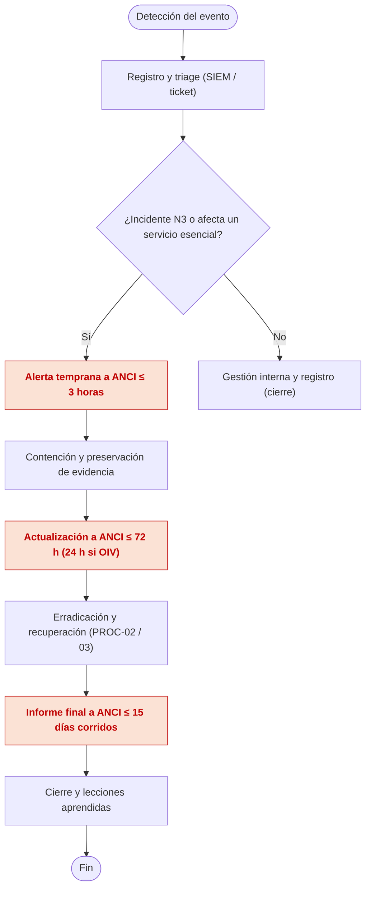

**Roles (RACI):** CISO, ERI, Gerencia TI, Legal  
**Evidencia / registros:** Ticket, cadena de custodia, reportes ANCI  
**Plazos / hitos:** 3 h / 72 h / 15 días  
**PNG:** `procedimientos/PROC-SGSI-05 - Gestión de incidentes y notificación ANCI.png`

### PROC-SGSI-06 — Alta, modificación y baja de accesos
*ISO/IEC 27001:2022: 5.16, 5.18, 8.2*

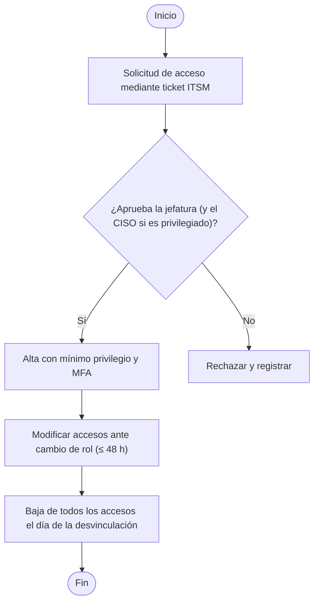

**Roles (RACI):** Gerencia TI, RRHH, jefatura  
**Evidencia / registros:** Ticket aprobado, logs de acceso  
**Plazos / hitos:** Baja el mismo día  
**PNG:** `procedimientos/PROC-SGSI-06 - Alta, modificación y baja de accesos.png`

### PROC-SGSI-07 — Revisión periódica de accesos
*ISO/IEC 27001:2022: 5.18*

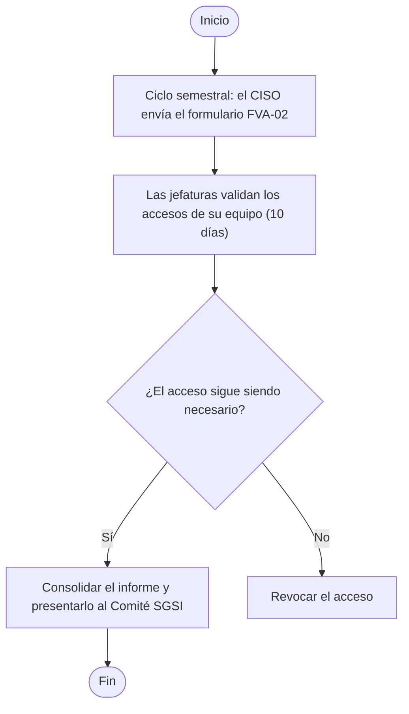

**Roles (RACI):** CISO, jefaturas  
**Evidencia / registros:** Formulario FVA-02, informe  
**Plazos / hitos:** Semestral  
**PNG:** `procedimientos/PROC-SGSI-07 - Revisión periódica de accesos.png`

### PROC-SGSI-08 — Uso del gestor de contraseñas
*ISO/IEC 27001:2022: 5.17, 8.5*

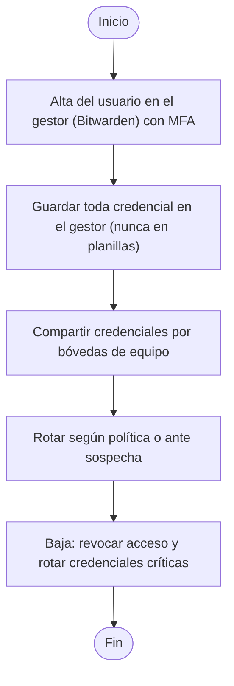

**Roles (RACI):** CISO, Gerencia TI, usuarios  
**Evidencia / registros:** Logs de bóvedas, registro de rotación  
**PNG:** `procedimientos/PROC-SGSI-08 - Uso del gestor de contraseñas.png`

### PROC-SGSI-09 — Segmentación y revisión de firewall
*ISO/IEC 27001:2022: 8.20, 8.22*

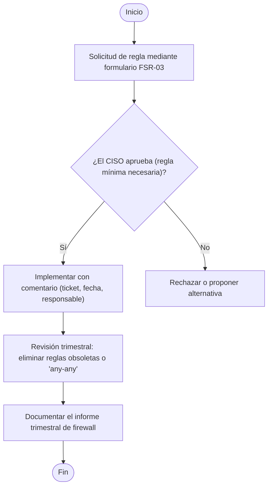

**Roles (RACI):** CISO, Infraestructura TI  
**Evidencia / registros:** Formulario FSR-03, informe trimestral  
**Plazos / hitos:** Revisión trimestral  
**PNG:** `procedimientos/PROC-SGSI-09 - Segmentación y revisión de firewall.png`

### PROC-SGSI-10 — Revisión y escalada de alertas
*ISO/IEC 27001:2022: 8.15, 8.16*

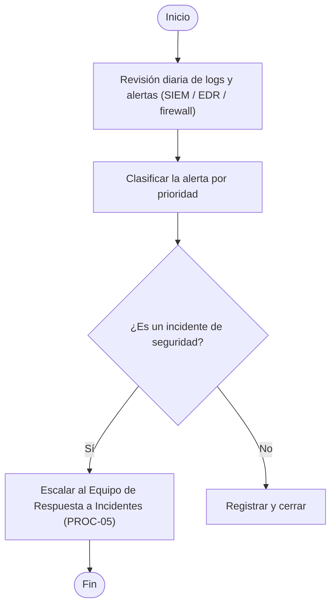

**Roles (RACI):** Analista SOC, CISO  
**Evidencia / registros:** Registro de alertas, ticket de escalada  
**Plazos / hitos:** Revisión diaria  
**PNG:** `procedimientos/PROC-SGSI-10 - Revisión y escalada de alertas.png`

### PROC-SGSI-11 — Escaneo de vulnerabilidades
*ISO/IEC 27001:2022: 8.8, 8.29*

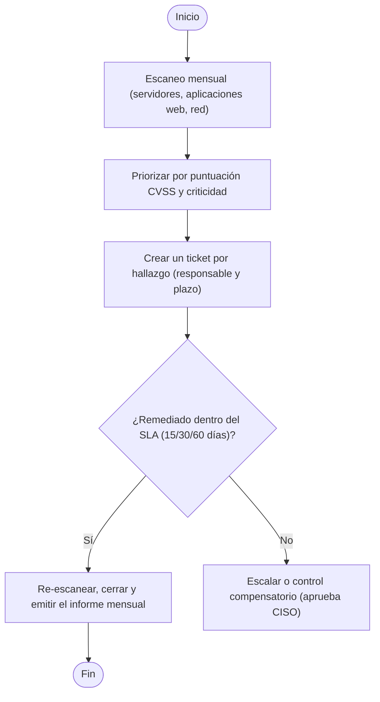

**Roles (RACI):** CISO, Gerencia TI, Desarrollo  
**Evidencia / registros:** Reporte de escaneo, tickets de remediación  
**Plazos / hitos:** Mensual; SLA 15/30/60 d  
**PNG:** `procedimientos/PROC-SGSI-11 - Escaneo de vulnerabilidades.png`

### PROC-SGSI-12 — Retención y eliminación segura
*ISO/IEC 27001:2022: 8.10, 8.13, 8.33*

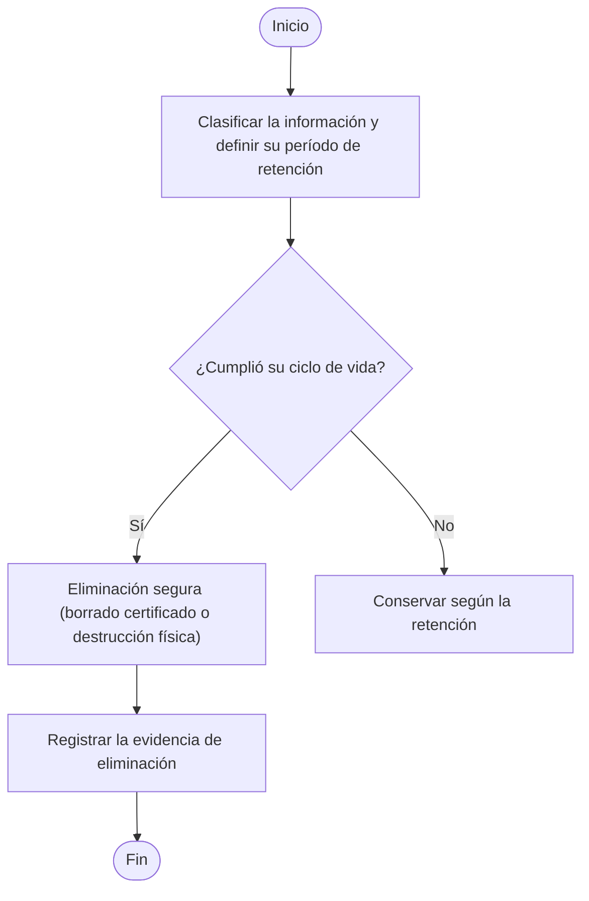

**Roles (RACI):** Gerencia TI, DPO  
**Evidencia / registros:** Registro de eliminación, certificado de borrado  
**Plazos / hitos:** Revisión anual  
**PNG:** `procedimientos/PROC-SGSI-12 - Retención y eliminación segura.png`

### PROC-SGSI-13 — Contratación y desvinculación
*ISO/IEC 27001:2022: 6.1, 6.2, 6.5*

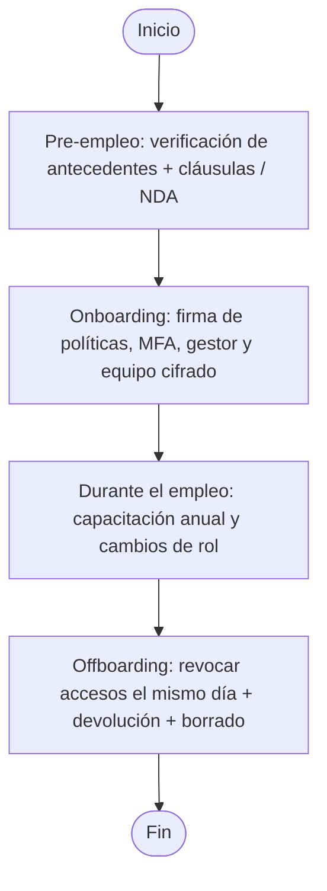

**Roles (RACI):** RRHH, Gerencia TI, jefatura  
**Evidencia / registros:** Checklist on/offboarding firmado  
**Plazos / hitos:** Baja el mismo día  
**PNG:** `procedimientos/PROC-SGSI-13 - Contratación y desvinculación.png`

### PROC-SGSI-14 — Evaluación de proveedores
*ISO/IEC 27001:2022: 5.19, 5.20, 5.21, 5.22*

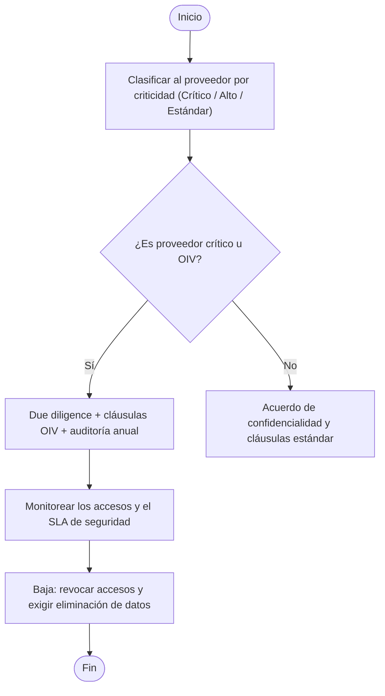

**Roles (RACI):** CISO, Adquisiciones  
**Evidencia / registros:** Due diligence, cláusulas, informe de auditoría  
**Plazos / hitos:** Auditoría anual  
**PNG:** `procedimientos/PROC-SGSI-14 - Evaluación de proveedores.png`

### PROC-SGSI-15 — Desarrollo seguro (SDLC)
*ISO/IEC 27001:2022: 8.25–8.29, 8.31*

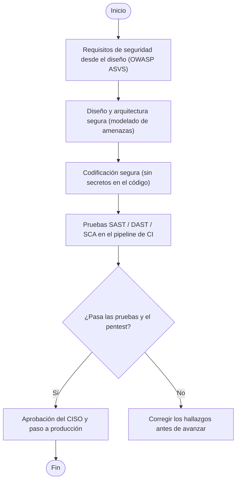

**Roles (RACI):** Jefe de Desarrollo, CISO  
**Evidencia / registros:** Reportes SAST/DAST, informe de pentest  
**Plazos / hitos:** Pentest en release mayor  
**PNG:** `procedimientos/PROC-SGSI-15 - Desarrollo seguro (SDLC).png`

### PROC-SGSI-16 — Respuesta ante malware
*ISO/IEC 27001:2022: 8.7*

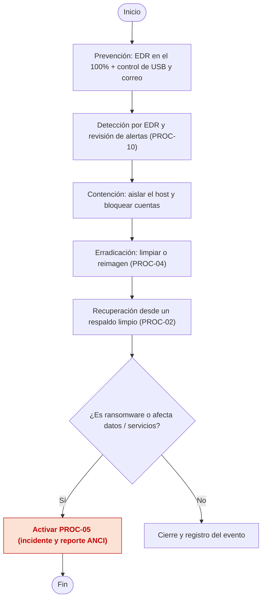

**Roles (RACI):** Analista de Ciberseguridad, CISO  
**Evidencia / registros:** Alertas EDR, informe post-evento  
**PNG:** `procedimientos/PROC-SGSI-16 - Respuesta ante malware.png`

### PROC-SGSI-17 — Uso seguro de dispositivos
*ISO/IEC 27001:2022: 8.1, 7.9, 6.7*

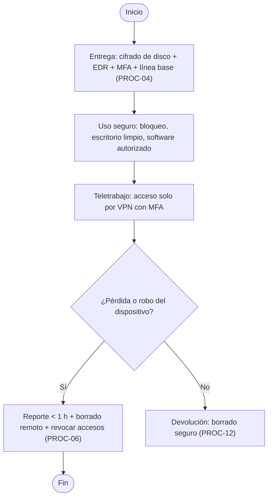

**Roles (RACI):** Gerencia TI, usuario, jefatura  
**Evidencia / registros:** Acta de entrega/devolución, reporte de pérdida  
**Plazos / hitos:** Reporte < 1 h  
**PNG:** `procedimientos/PROC-SGSI-17 - Uso seguro de dispositivos.png`

### PROC-SGSI-18 — Cifrado y gestión de llaves
*ISO/IEC 27001:2022: 8.24*

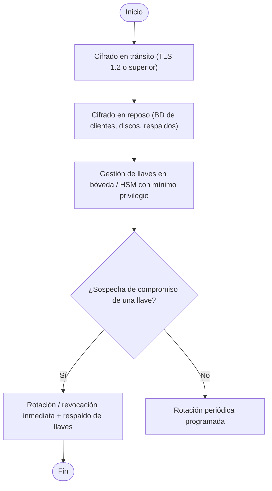

**Roles (RACI):** CISO, Gerencia TI / DBA  
**Evidencia / registros:** Inventario de llaves, configuración TLS  
**Plazos / hitos:** Rotación periódica  
**PNG:** `procedimientos/PROC-SGSI-18 - Cifrado y gestión de llaves.png`
