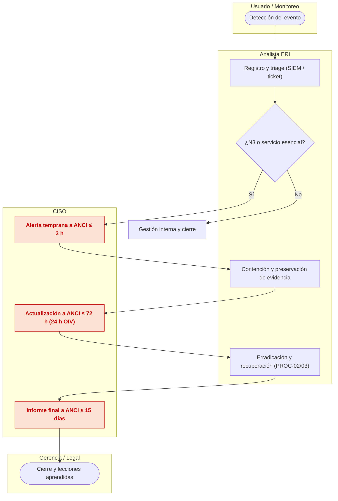
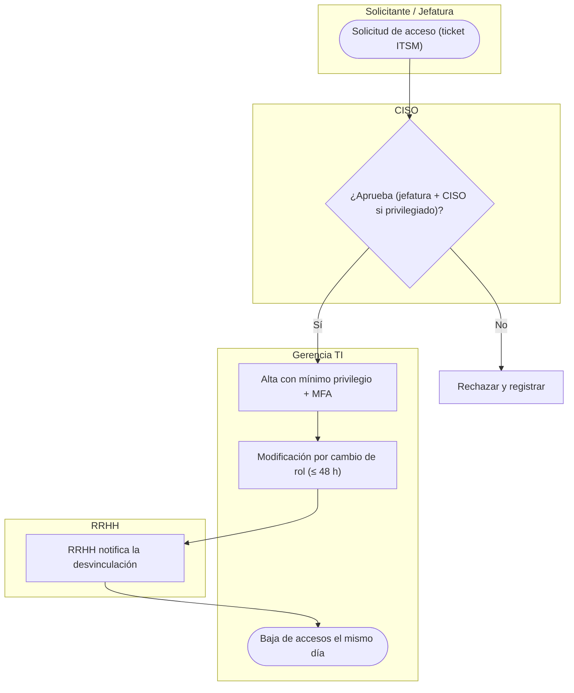
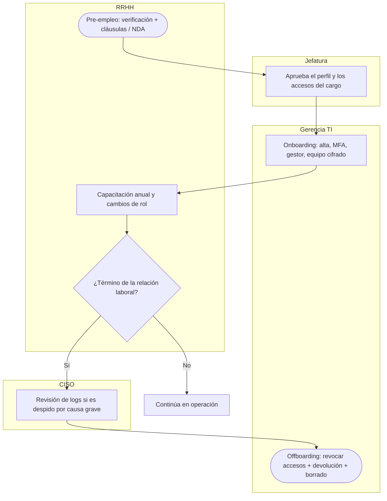
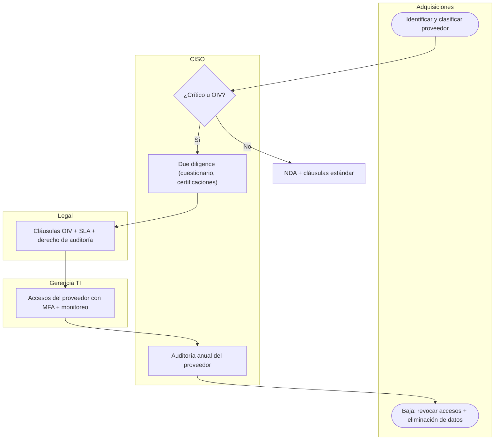

# Diagramas swimlane (carriles por rol) — procedimientos transversales

Versión BPMN con carriles por actor (RACI) de los procedimientos con más de un responsable. PNG en `swimlanes/` (fuente SVG en `fuentes-svg/swimlanes/`); abajo la versión Mermaid (subgraph por carril) que se renderiza en GitHub.

### PROC-SGSI-05 — Gestión de incidentes y notificación ANCI
*ISO/IEC 27001:2022: 5.24–5.26 · carriles: Usuario / Monitoreo · Analista ERI · CISO · Gerencia / Legal*

**PNG:** `swimlanes/PROC-SGSI-05 - Gestión de incidentes y notificación ANCI (swimlane).png`

### PROC-SGSI-06 — Alta, modificación y baja de accesos
*ISO/IEC 27001:2022: 5.16, 5.18, 8.2 · carriles: Solicitante / Jefatura · CISO · Gerencia TI · RRHH*

**PNG:** `swimlanes/PROC-SGSI-06 - Alta, modificación y baja de accesos (swimlane).png`

### PROC-SGSI-13 — Contratación y desvinculación
*ISO/IEC 27001:2022: 6.1, 6.2, 6.5 · carriles: RRHH · Jefatura · Gerencia TI · CISO*

**PNG:** `swimlanes/PROC-SGSI-13 - Contratación y desvinculación (swimlane).png`

### PROC-SGSI-14 — Evaluación de proveedores
*ISO/IEC 27001:2022: 5.19–5.22 · carriles: Adquisiciones · CISO · Legal · Gerencia TI*

**PNG:** `swimlanes/PROC-SGSI-14 - Evaluación de proveedores (swimlane).png`
